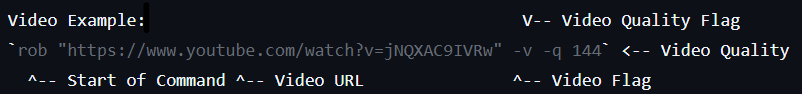

# rob - "robocopies other brother"
rob - youtube &amp; file downloader

## What is "rob"?
rob is a command-line tool to download files (using cURL), or YouTube Videos (using the yt-dlp Python3 library.)

## Why not use standalone tools?
rob is designed to group all theese tools together, to be used in one command.

## Usage
```
usage:
[-h] - displays this help menu
[-q <QUALITY>] - specify the quality of the video to be downloaded (to be used after the -v flag) 
[-f] - specifies that the image/video to download IS a file (.txt, .bat .sh, etc)
[-v] specifies that the image/video to download IS a video (a YouTube video)
url - has to be included, doesn't have to be specified.
```
## Example
Video Example<br>

<br>
File Example
